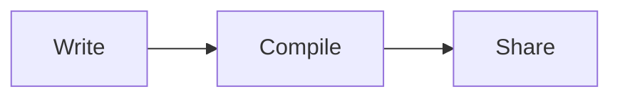

## Everything together

| Input | Output |
| --- | --- |
| Swift | Highlighted code |
| TeX | MathML |
| Mermaid | SVG |

```swift
let radius = 3
```

```math
A = \pi r^2
```


```mermaid
flowchart LR
A[Write] --> B[Compile] --> C[Share]
```
